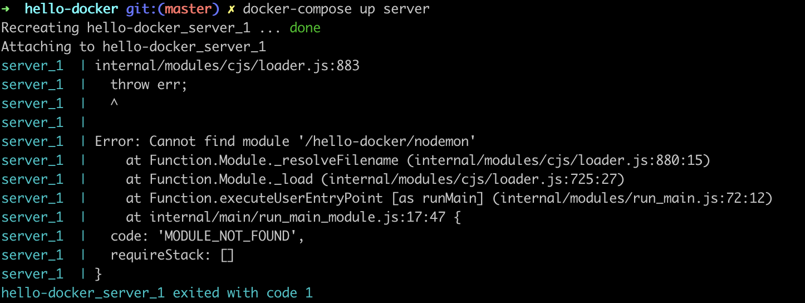

### Developing a Node app in Docker, 2021 edition ###

## Goal - set up a system for developing a Node/JS app in Docker

# Why Docker?

Docker is the modern way to ship code and run it anywhere, and also guarantees that multiple developers working on the same project will have the same environment.

## Step 1 - create Hello World backend to have something to show

To begin, I wrote an extremely simple Express backend that serves "Hello Docker" from the root, so I can test if the server is responding.

# Git repo layout

Our app will eventually have a client and a server component, and these will be stored in different folders within the repo. My docker-compose file will allow me to build and run multiple services with one command. 

## Step 2 - Install Docker and create Dockerhub account

// Fill in later

## Step 3 - Create Dockerfile for server directory

Each service needs its own Dockerfile (there will be another one for the client directory). Mine looks like this:

```
FROM node:lts-alpine3.12 // the base layer of the container will be this Node image that is itself based on a version of Linux. I don't need to download this now; Docker will automatically get it from DockerHub when building the container
WORKDIR /hello-docker 
COPY src . // I need the files in my src directory. The dot says "copy everything." I could also specify individual files or directories.
COPY package.json . // I need the package.json first so I can install the nodemon tool globally within the container's virtual file system
RUN yarn global add nodemon // here I am installing it globally
RUN yarn install // the rest of the dependencies in package.json are installed locally within the project
CMD ["node", "src/index.js"] // how we will start up the server in production
```

## Development vs production tools

Additionally, I want to be able to make changes to my files locally and see them reflected immediately within the Docker container in my local environment. This is another reason to use a docker-compose file because I can mount my local files as a volume without having to do it from the command line every time. 

I also want my Node server to restart every time I make changes to the code in development, without having to restart the Docker container every time. The way to do this is a tool called `nodemon`. 

The Dockerfile for the server contains instructions for building, and a command that should be run to start the service. This is what will be used in production.

In `docker-compose` I can overwrite this default command with nodemon. Since commands in `docker-compose` override commands in the Dockerfile, `docker-compose build server && docker-compose up` will launch my app with `nodemon`. This tool is available because I installed it globally above.

```
version: '3.8'

services:
  server:
    build:
      context: ./server
      dockerfile: Dockerfile
    ports:
      - 3200:3200
    volumes:
      - ./server:/hello-docker
    command: nodemon src/index.js
```

Now the production evnironment will use Node while I can use `nodemon` to watch for changes locally. 

[reference: https://medium.com/better-programming/docker-in-development-with-nodemon-d500366e74df]

## A bind mount (disguised as a volume)

Docker has two ways to store persistent data, bind mounts and volumes. They both use storage on the host machine (i.e. my computer) but data on volumes can only be modified by Docker processes while data on bind mounts can also be modified by non-Docker processes, such as an IDE. 

Volumes are commonly used for databases, or files such as images that you want to store on a remote host.

To connect our local development files to the container, I will use a . This allows me to edit my code and see the changes locally. When I am ready to deploy, I will rebuild the container with the changed code and push the build to the cloud. At that point Docker will copy everything in the build directly into the image, and no longer rely on a bind mount.

The `docker-compose` syntax uses the term "volumes" to refer to both volumes and bind mounts. On the left side of the `:` field separator is the source for the data (here `./server`); on the right side is the location it should be accessible from within the Docker container (here `/hello-docker`).

```
    volumes:
        - ./server:/hello-docker
```

You (and Docker) can tell this is a bind mount rather than a volume because it contains a path (`./server`) as its source.
[reference](https://maximorlov.com/docker-compose-syntax-volume-or-bind-mount/)

## Troubleshooting ##
if container exits right away - inspect file system
explain why container stops running when the program exits (crashes) so you can't inspect file system because there's no reasonable way to look inside a container that's not running
So we need to create an infinite loop for testing so that some process will be running in the container even when the service that is specified in the Dockerfile to start on run crashes.
A common utility that runs forever is `top` (we could also write our own infinite loop and put it in the Docker image, but top is almost always there).



to get here we:
// built one of the services in the docker-compose
// ran the container
    `docker-compose build server && docker-compose up server`
// running `docker ps` doesn't show any running containers because it crashed
running `docker ps -a` shows the name of the container and when it started and exited

Remind myself what the name of the already built image was by running `docker ps -a`

IMAGE = name of the built image that docker will use to create a container
NAME = name of this particular container that came from the image.

Image name was `hello-docker_server`. Docker created a name for the container automatically which was `hello-docker_server_1`.

NOW WE USE TOP to keep the container running even after the app crashes

`docker run -d --name hello-demo3 hello-docker_server /usr/bin/top`

Instead of `docker-compose up` I use `docker run` directly so I can pass in a starting command that will override the starting command specified in the Dockerfile.

`-d` is 'detached' so it will run in the background and give me the terminal back.

I also pass in an optional name that is more different than the autogenerated one. 

Then the command is the filepath to the `top` utility. This is not a command I am running from the command line here, it is an additional parameter telling Docker what to do when it is starting the container.

Now my container will run indefinitely.

Run `docker exec -ti hello-demo3 sh` to open a shell from within the file system in the Docker container.

And, I can look around the directories to see what files are and are not present.


        

            


